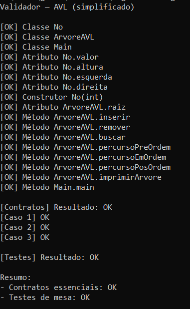
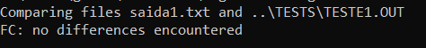
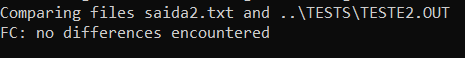
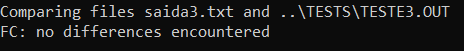

# Desafio Algoritmos e Programação: Árvores e Ordenação - Giovana, Leonardo e Luís

Desafio Algoritmos e Programação: Árvores e Ordenação (061306_20252_01)

## Instruções de compilação e execução do validador:
- Acessar a pasta src através do cmd
- Para rodar o validador execute os comandos abaixo:
    ```
    javac No.java ArvoreAVL.java Main.java Validador.java
    javac -encoding UTF-8 Validador.java
    java Validador
    ```

## Instruções de execução dos casos de teste mesa:
- Acessar a pasta src através do cmd
- Para rodar cada teste execute os comandos abaixo:
    ```
    javac No.java ArvoreAVL.java Main.java Validador.java
    java Main < ..\tests\teste1.in > saida1.txt
    fc saida1.txt ..\tests\teste1.out
    ```

## Participação dos integrantes:
- Giovana Alexine Virissimo Pinto: métodos buscar, percursoPreOrdem, percursoEmOrdem, percursoPosOrdem, imprimirArvore, pre, em, pos.
- Leonardo da Rosa de Almeida: métodos inserir, inserirRec, altura, fatorBalanceamento, rotacaoDireita, rotacaoEsquerda.
- Luís Felipe Soares Santos da Conceição: métodos remover, removerRec, contem.

## Status validador:


## Status casos de teste de mesa:
### Teste 1:


### Teste 2:


### Teste 3:
